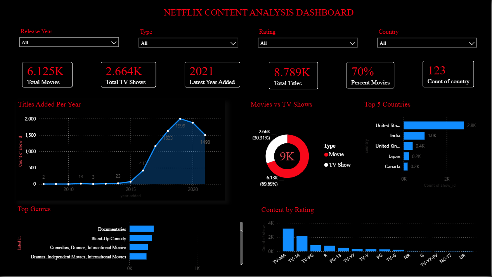

# Netflix Content Analysis Dashboard

A data analysis project where I explored Netflix's content catalog — cleaned the raw data, ran an exploratory analysis in Python, wrote some SQL queries, and built an interactive Power BI dashboard on top of it all.

## About the Project

I wanted to understand how Netflix's content library has grown over the years what kind of content they add, which countries produce the most titles, what genres dominate, and how movies compare to TV shows. This project goes through the full process: starting from a messy raw CSV, cleaning it up in Python, exploring it with charts, querying it in SQL, and finally putting it all together in a dashboard.

**A quick snapshot of the data:**
- 8,789 titles in total
- 6,125 Movies and 2,664 TV Shows — so movies make up about 70% of the catalog
- Content goes up to release year 2021
- 123 different country combinations show up in the data

## Tools Used
- Excel – initial data exploration
- Python (Pandas) – data cleaning & EDA
- SQL (DB Browser for SQLite) – business analysis queries
- Power BI – interactive dashboard

## Folder Structure

Netflix-Data-Analysis-Dashboard/
├── data/
│   ├── netflix_titles.csv          (original dataset)
│   └── netflix_cleaned.csv         (after cleaning)
├── python/
│   └── netflix_cleaning_eda.ipynb
├── sql/
│   └── netflix_queries.sql
├── powerbi/
│   └── Netflix-Data-Analysis-Dashboard.pbix
├── images/
│   ├── dashboard.png
│   ├── movies_vs_tvshows.png
│   ├── content_added_per_year.png
│   ├── top_10_countries.png
│   ├── top_10_genres.png
│   ├── rating_distribution.png
│   └── movie_duration.png
└── README.md

## Cleaning the Data

The raw dataset had a fair amount of missing information, so before doing anything else I had to clean it up:

- Filled missing `director`, `cast`, and `country` values with "Unknown" instead of dropping those rows
- Dropped the few rows where `date_added` was missing
- Converted `date_added` into a proper date format and pulled out the year and month separately
- Split 'duration' into a number and a unit, since movies are measured in minutes and TV shows in seasons
- Removed duplicate rows

## Exploring the Data

Here's what stood out once I started charting things:

Movies dominate the catalog — roughly 70% of everything on Netflix is a movie, not a show.

Netflix's content additions barely moved before 2015, then shot up fast between 2016 and 2020. That's clearly their big expansion phase.

The US produces the most content by a wide margin, with India in second place.

International Movies and Dramas come out on top as the most common genres.

TV-MA is the most common rating, followed by TV-14 — so a lot of the catalog leans toward mature audiences.

Most movies fall somewhere between 80 and 120 minutes, which is pretty standard for a feature film.

## Querying with SQL

I loaded the cleaned data into SQLite and wrote queries to dig into things like yearly trends, the most common genres and ratings, and which titles had the longest runtimes or the most seasons. All the queries are in [`sql/netflix_queries.sql`](sql/netflix_queries.sql).

## The Dashboard

Everything comes together in the Power BI dashboard, with filters for Release Year, Type, Rating, and Country so you can slice the data however you want. It shows:

- Key numbers at a glance (total movies, total shows, total titles, latest year added, % movies)
- A year-by-year trend of content added
- Movies vs TV Shows breakdown
- Top 5 countries by content count
- Top genres
- Content split by rating

## What I Took Away From This

- Netflix's catalog is still movie-heavy, even though TV shows tend to get more attention.
- 2016–2020 was clearly a growth period — that's when the bulk of the current library was added.
- The US and India are the two biggest content sources, by a noticeable margin over everyone else.
- TV-MA being the top rating suggests Netflix's catalog skews more toward adult audiences than family content.
- Movie runtimes cluster around the 90-minute mark, which lines up with typical film lengths.

## Running This Yourself

1. Clone the repo
2. Open `python/netflix_cleaning_eda.ipynb` to see how the data was cleaned and explored
3. Run the queries in `sql/netflix_queries.sql` against the cleaned CSV in your SQL tool of choice
4. Open `powerbi/Netflix-Data-Analysis-Dashboard.pbix` in Power BI Desktop to explore the dashboard

## Dataset

Used the publicly available Netflix Movies and TV Shows dataset from Kaggle.
